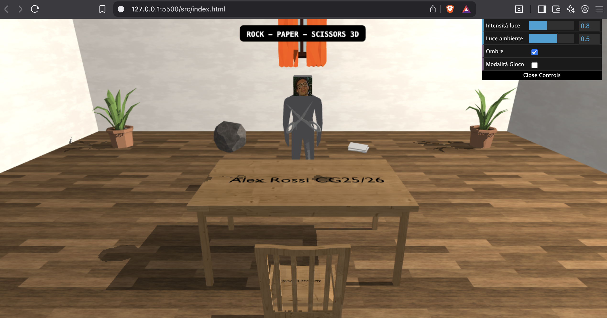
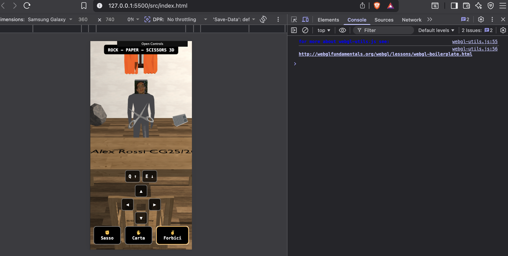
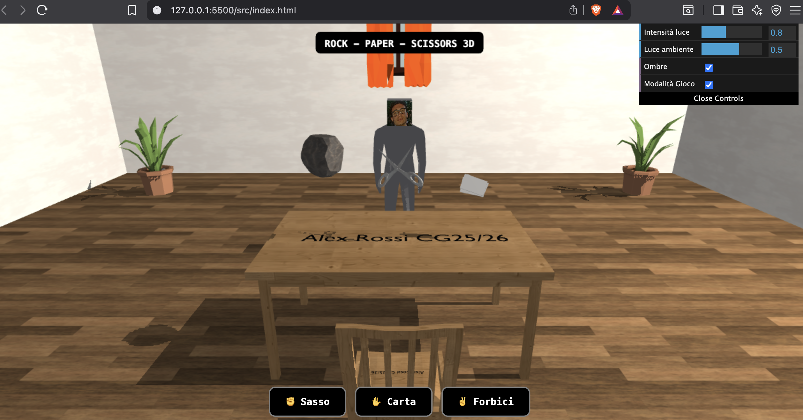

# Computer Graphics Project 2025/2026 — Rock Paper Scissors 3D

## Table of Contents

1. [Project Idea](#1-project-idea)
2. [Controls Tutorial](#2-controls-tutorial)
3. [Use of Blender](#3-use-of-blender)
4. [Implementation Choices](#4-implementation-choices)
   1. [globals.js](#41-globalsjs)
   2. [shaders.js](#42-shadersjs)
   3. [texture.js](#43-texturejs)
   4. [room.js](#44-roomjs)
   5. [mesh.js](#45-meshjs)
   6. [scene.js](#46-scenejs)
   7. [shadow.js](#47-shadowjs)
   8. [input.js](#48-inputjs)
   9. [gui.js](#49-guijs)
   10. [hud.js](#410-hudjs)
   11. [game.js](#411-gamejs)
   12. [main.js](#412-mainjs)
5. [Future Work](#5-future-work)
6. [Acknowledgements](#6-acknowledgements)
7. [References](#7-references)

---

## 1. Project Idea

The project consists of an interactive 3D game based on the classic "Rock Paper Scissors" game, with the main focus placed on the implemented 3D scene.

The scene depicts a closed room with walls, floor and ceiling, furnished with a table in the centre, a chair, a mannequin and some decorative elements. The primary light source is a directional light that simulates indoor artificial illumination, casting dynamic shadows on the objects and surfaces of the scene. Note that the position of the light source is not correlated with the three windows present in the scene. The player can move freely inside the room through a camera, using a keyboard-and-mouse control system on desktop, or on-screen touch controls on mobile devices.

Through the dedicated GUI it is possible to interact with the environment by modifying the light intensity, the ambient light component, and by toggling scene shadows on or off. Additionally, also through the GUI, it is possible to activate game mode, which allows the player to challenge a virtual opponent in a classic game of "Rock Paper Scissors".

---

## 2. Controls Tutorial

The following controls can be used to move within the scene.

**Desktop:**

- **W / Arrow Up:** move forward (decreases position on the Z axis)
- **A / Arrow Left:** move left (decreases position on the X axis)
- **S / Arrow Down:** move backward (increases position on the Z axis)
- **D / Arrow Right:** move right (increases position on the X axis)
- **Q:** move upward (increases position on the Y axis)
- **E:** move downward (decreases position on the Y axis)
- **Mouse drag:** orbit the camera around the point of interest
- **Scroll:** zoom in/out

**Mobile:**

- **On-screen D-pad:** movement equivalent to the W/A/S/D keys described above
- **Single-finger drag:** orbit the camera
- **Two-finger pinch:** zoom in/out

---

## 3. Use of Blender

Blender was used as a post-processing tool to adapt 3D models downloaded from external sources to the specific needs of the project. The main operations performed are described below.

### Mesh Simplicity Verification

Using Blender it was possible to verify that the downloaded meshes contained a low polygon count, in order to have models suitable for real-time rendering via WebGL.

### UV Coordinate Correction and Texture Application

Many of the models present in the project scene (such as the table, chair and rock) had new textures applied in place of the originals. To do this, it was necessary to correct the UV coordinates of the models themselves.

### Material Separation and Grouping

For the mannequin model it was necessary to split the mesh into distinct parts (e.g. head and body) and assign different materials to each, so that different textures could be applied to individual sub-parts within the project's rendering system. Another noteworthy modification was the addition of a specific material for the black text present on the table and chair meshes.

### Export in OBJ/MTL Format

Upon completion of the edits, each model was exported in OBJ format with the corresponding MTL file using Blender's built-in export function. During export, options were enabled to include per-vertex normals and UV coordinates, both of which are required for the correct functioning of Phong illumination and texture mapping in the project.

---

## 4. Implementation Choices

For better organisation, the project is divided into JavaScript modules loaded within the same HTML page, communicating through global variables. The loading order of the modules is relevant, as some depend on others (for example, `scene.js` depends on `mesh.js` and `room.js`).

The rendering pipeline is divided into two passes:

- **Depth pass:** the scene is rendered from the light's point of view, writing only depth values into the shadow map framebuffer.
- **Final render:** the scene is rendered from the camera's point of view, using the previously computed shadow map to determine dynamic shadows through the Phong illumination model.

This separation is necessary for the correct implementation of the shadow mapping technique, which can be enabled or disabled through the GUI.

### 4.1 globals.js

This file declares all global variables used in the project, including the WebGL context, shader programs, spherical camera parameters, and shadow map-related parameters.

Among the most relevant variables: the shader programs for the render and depth passes (`mainProg` and `depthProg`); variables related to the shadow mapping technique, such as `shadowFBO` (framebuffer for depth), `shadowTex` (texture in which depth is stored), and `g_texMat` (the matrix that transforms coordinates from world space to shadow map UV coordinates in `[0,1]`); camera management variables such as `TARGET` (the XYZ coordinates around which the camera orbits); GUI-controllable parameters; and variables related to scene objects, such as the `sceneObjects` array.

### 4.2 shaders.js

This file defines the four shaders used in the project:

- **VS_DEPTH:** vertex shader for the depth pass, which computes vertex positions from the light's point of view.
- **FS_DEPTH:** fragment shader for the depth pass, which writes depth as a colour value. In the context of this project, this shader is essential to avoid the error *GL_INVALID_OPERATION: Active draw buffers with missing fragment shader outputs*, which occurs when a framebuffer with a colour attachment receives no output from the fragment shader.
- **VS:** vertex shader for the render pass, which computes the final positions of vertices, transformed normals and texture coordinates for the shadow map, taking into account the view, projection, model and texture matrices.
- **FS:** fragment shader for the render pass, which implements the Phong illumination model (using the corresponding rendering equation) and uses the previously computed shadow map, via *varying* values, to determine the final colour and dynamic shadows of each fragment.

### 4.3 texture.js

This module contains the functions required for correct texture management. In particular:

- `makeWhiteTexture()`: creates a 1×1 white texture used as a placeholder when no texture is associated with an object.
- `loadTex(url)`: given a URL path to an image, returns a WebGL texture. If the image dimensions are a power of two, mipmapping is used; otherwise, clamping and linear interpolation are applied.
- `loadRoomTextures()`: loads all textures required for the room panels.

### 4.4 room.js

This file contains the functions required for the creation and management of the room's geometry and associated textures. In particular:

- `buildRoom()`: defines the room geometry — ceiling, floor, and the four walls (wallN, wallS, wallE, wallW).
- `mkPanel(pos4, norm1, R, name)`: creates a room panel from the supplied parameters: `pos4` (spatial positions of the four vertices), `norm1` (panel normal), `R` (texture tiling factor) and `name` (panel identifier), initialising the respective WebGL buffers.
- `drawPanel(panel, tex, Kd, Ks, Ns, P, V)`: draws a room panel with Phong illumination and shadows. Using the panel and the supplied values (texture, material parameters, and view/projection matrices), it uses data computed by `mainProg` to handle shadows and illumination.
- `drawRoom(P, V)`: draws the entire room, passing the projection and view matrices.

### 4.5 mesh.js

This file collects the functions required for parsing, creating and managing the 3D meshes present in the scene. Specifically:

- `loadOBJ(objUrl, texUrl, modelMatrix, mat, matTextures)`: asynchronously loads an OBJ file and its associated MTL file, initialising the mesh and associated textures. From the supplied parameters (OBJ file path — from which the MTL file path is also derived — texture path, and transformation matrices), it creates a mesh object with the relevant WebGL buffers, which is then added to the global `sceneObjects` array.
- `buildOBJBuffers(mesh)`: constructs buffers for an OBJ mesh, grouping faces by associated material (as happens, for example, with the mannequin in the scene) and creating buffers for each group.
- `buildModelMatrix(pos, rotY, scale)`: constructs the model matrix from the supplied position, rotation, and scale parameters. This function is particularly useful for correctly positioning objects in the scene and managing their animations.
- `drawOBJ(obj, P, V)`: draws an OBJ mesh with Phong illumination and shadows. Analogously to `drawPanel()` in `room.js`, using the object and the projection/view matrices, it uses data computed by `mainProg` to handle shadows and illumination. The sub-parts of the mesh are drawn independently: based on the associated material and its characteristics, each part can be rendered in a specific way. For example, the variable `isBlack` identifies the black text present on the table and chair meshes, allowing them to be correctly rendered as nearly-black, clearly visible surfaces.

### 4.6 scene.js

This module contains the functions required for positioning objects in the scene and managing any animations:

- `loadSceneObjects()`: asynchronously loads all OBJ meshes present in the scene, positioning them correctly by constructing model matrices specific to each object.
- `updateAnimations(dt)`: updates the animations in the scene; in particular it manages the rotation of the rock (around the Z axis), the scissors (around the Y axis) and the stack of paper (around the X axis).

### 4.7 shadow.js

This module contains two fundamental functions for the implementation of shadow mapping:

- `getLightMatrices()`: computes and returns the view and projection matrices required for the depth pass, based on the light source position and the light target.
- `drawSceneDepth()`: draws the scene during the depth pass (from the light's point of view), using only the position vertex buffer.

### 4.8 input.js

This module contains the functions that handle keyboard, mouse and touch input:

- `initInput(canvas)`: registers event listeners for keyboard, mouse and touch, and initialises the variables required for input management.
- `updateInput(dt)`: handles camera movement based on received keyboard input and applies clamping — that is, restricts the camera target's position to within the room area — in order to prevent the camera from leaving the room or passing through its walls.

### 4.9 gui.js

This module contains the `initGUI()` function, which initialises the dat.GUI control panel, creating controls for the scene parameters: light intensity, ambient light component, and shadow toggle. A control is also provided to activate or deactivate game mode, which allows the player to challenge a virtual opponent in a classic game of "Rock Paper Scissors".

### 4.10 hud.js

This module contains the `drawHUD()` function, which draws the 2D title overlaid on the 3D scene, and the utility function `rrect()`, which draws a rounded-corner rectangle used as the background of the title itself.

### 4.11 game.js

This module contains the functions that manage the "Rock Paper Scissors" game and the related mobile device controls:

- `playRPS(move)`: given the move chosen by the player via the on-screen buttons, simulates the virtual opponent's move and determines the outcome of the match (win, loss or draw), displaying the relevant feedback on screen.
- `isMobile()`: utility function that checks whether the user is running the application on a mobile device, assuming the screen is mobile if its width is less than or equal to 768px.
- `setupMobileBtn(id)`: utility function that binds the touch events of a button to the corresponding `keys[]` dictionary, while also preventing the browser's default behaviour (such as scrolling or zooming) when interacting with on-screen buttons.
- `updateMobileControlsPos()`: utility function that updates the on-screen position of the camera movement control buttons based on whether or not the game-mode move buttons are present.
- `updateMobileVisibility()`: utility function that makes the on-screen movement controls visible when the user is on a mobile device, and hides them otherwise.

### 4.12 main.js

This is the entry point of the programme, invoked on the page's *load* event. In particular, the module contains the following functions:

- `init()`: asynchronous function that initialises the WebGL context, shader programmes and framebuffers for the shadow map, and calls the functions required to build the scene, load textures and objects, and initialise input and the GUI. Upon completion of initialisation, it starts the rendering loop via `requestAnimationFrame(loop)`.
- `resizeCanvas()`: utility function that resizes the canvas according to the browser window dimensions.
- `loop(ts)`: function representing the programme's rendering loop. Using the timestamp `ts` provided by `requestAnimationFrame`, it computes the delta time `dt` and calls the functions required to update input, animations, and draw the scene. Specifically, on the first call the text "Loading Scene..." is displayed on screen for approximately one second; subsequently, the relevant variables are computed (camera position, screen aspect ratio, projection and view matrices) and the two passes are executed: first the depth pass for shadow map computation, then the final render with shadows. Finally, `requestAnimationFrame(loop)` is called again to continue the rendering loop.

---

## 5. Future Work

The project has some known issues that could be addressed in future versions:

- **Camera movement inconsistent with view direction:** the current implementation allows the camera to move along the three world-space XYZ axes. However, if the camera is rotated via mouse drag, keyboard movements are no longer consistent with the direction the camera is facing, making navigation feel unintuitive. A possible solution would be to implement a movement system based on the camera's local coordinates, so that the movement keys are always aligned with the view direction.

- **Wall clipping during orbit:** the current clamping logic restricts the position of the camera target, but does not prevent the camera itself from clipping through walls when orbiting with the target positioned near the room's edges. A possible solution would be to implement a collision system between the camera and the walls that also takes into account the camera's actual position in space, not just its target.

- **Mobile device detection:** the method currently used to detect mobile devices is based on screen width, which is fragile in some cases. For example, a mobile device in landscape mode could be mistakenly identified as a desktop, making the on-screen controls unavailable. A more robust solution could be based on browser user agent analysis or other mobile-device-specific characteristics.

Further improvements are possible in the Computer Graphics domain, such as implementing more advanced rendering techniques (e.g. bump mapping, as suggested in the project brief). Additional improvements could address code management (such as a more efficient structure for the scene drawing loop) and memory optimisation, an aspect not addressed in the current design.

---

## 6. Acknowledgements

The following 3D models — subsequently modified using Blender — were downloaded from Poly Pizza for use in this project:

- **Rock:** Boulder by Poly by Google [CC-BY] ([CC 3.0](https://creativecommons.org/licenses/by/3.0/)) via [Poly Pizza](https://poly.pizza/m/3jql0qtape-)
- **Scissors:** Scissors by sirkitree [CC-BY] ([CC 3.0](https://creativecommons.org/licenses/by/3.0/)) via [Poly Pizza](https://poly.pizza/m/bDr42ZTldYp)
- **Table:** Table by Hunter Paramore [CC-BY] ([CC 3.0](https://creativecommons.org/licenses/by/3.0/)) via [Poly Pizza](https://poly.pizza/m/7qAyGZnerYt)
- **Chair:** Chair by Poly by Google [CC-BY] ([CC 3.0](https://creativecommons.org/licenses/by/3.0/)) via [Poly Pizza](https://poly.pizza/m/49lEx3gLfn9)
- **Paper:** Small Stack of Paper by Jarlan Perez [CC-BY] ([CC 3.0](https://creativecommons.org/licenses/by/3.0/)) via [Poly Pizza](https://poly.pizza/m/aiBozYlPe--)
- **Plant:** House plant by Poly by Google [CC-BY] ([CC 3.0](https://creativecommons.org/licenses/by/3.0/)) via [Poly Pizza](https://poly.pizza/m/3qh9saogdJd)
- **Door:** Doorway by Kenney via [Poly Pizza](https://poly.pizza/m/NjrIKzZLYv)
- **Window:** Window by Jonathan Granskog [CC-BY] ([CC 3.0](https://creativecommons.org/licenses/by/3.0/)) via [Poly Pizza](https://poly.pizza/m/9FqbXmzB-CS)

And from Sketchfab:

- **Mannequin:** Low Poly Dummy / Human Figure by moogh [CC BY 4.0] ([CC 4.0](https://creativecommons.org/licenses/by/4.0/)) via [Sketchfab](https://skfb.ly/orOqq)

---

## 7. References

In addition to the course materials (such as `sphere_shadow_mapping_GUI.js`), the following references were consulted during the development of this project:

- WebGL Fundamentals — [webglfundamentals.org](https://webglfundamentals.org)
- Shadow Mapping — [webglfundamentals.org/webgl/lessons/webgl-shadows.html](https://webglfundamentals.org/webgl/lessons/webgl-shadows.html)
- Shadow Mapping — [roblouie.com](https://roblouie.com/article/1114/webgl-shadow-maps-part-2-lighting/)
- Shadow Mapping — [github.com/sketchpunk/FunWithWebGL2](https://github.com/sketchpunk/FunWithWebGL2/tree/master/lesson_094_shadow_mapping)
- 3D Models — [poly.pizza](https://poly.pizza/)
- 3D Models — [sketchfab.com](https://sketchfab.com/)
- Textures — [polyhaven.com](https://polyhaven.com/)